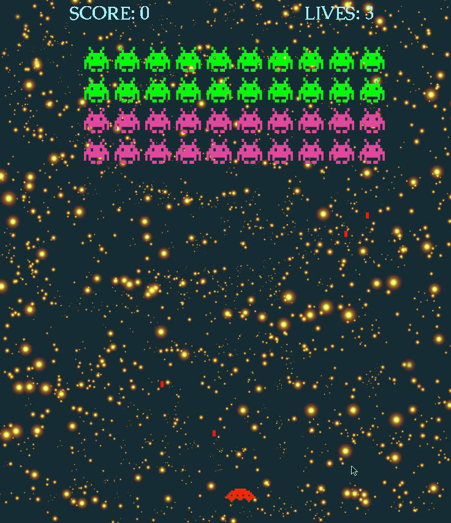
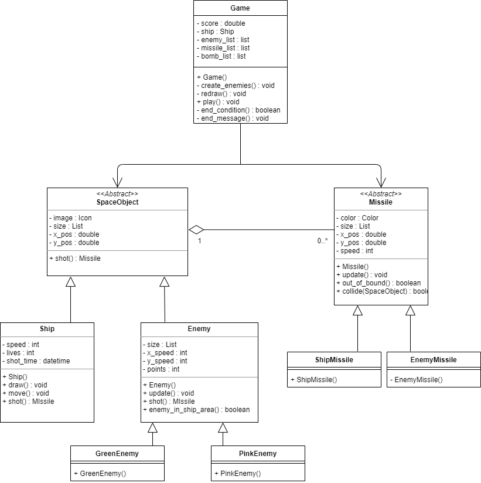
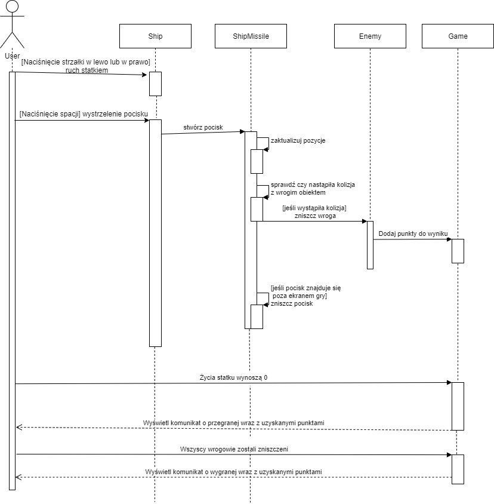
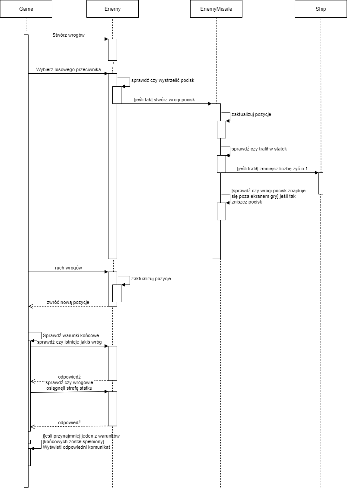

# Space Invaders
Created game based on popular [Space Invaders](https://en.wikipedia.org/wiki/Space_Invaders). The main purpose of creating the game was to write detailed [specification](https://github.com/Dydek123/SpaceInvaders/blob/master/Specification.pdf) and [UML diagrams](#link) (Class and use case diagrams) for the product and then create application based on documentation.

## Table of contents
* [Technologies](#technologies)
* [Game](#game)
* [Specification (PL)](https://github.com/Dydek123/SpaceInvaders/blob/master/Specification.pdf)
* [UML Diagrams](#uml-diagrams)
    - [Class diagram](#game)
    - [Use cases](#game)

## Technologies
Python (PyGame + Tkinter)

## Game

## Detailed specification
### [Specification (PL)](https://github.com/Dydek123/SpaceInvaders/blob/master/Specification.pdf)

## UML Diagrams
* **Class diagram** 
* **Use cases diagram (PL)** 
 
 